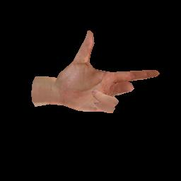
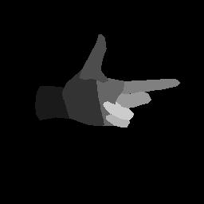
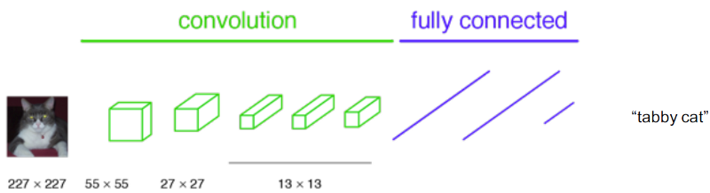
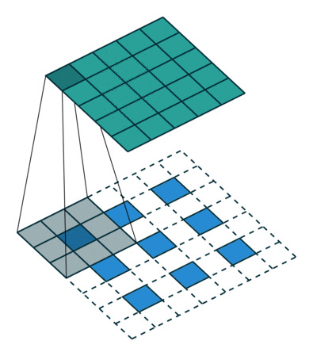
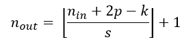
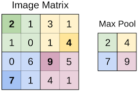

# Riconoscimento delle parti della mano mediante deep learning

<!-- vscode-markdown-toc -->
* 1. [Introduzione](#Introduzione)
* 2. [La rete neurale](#Lareteneurale)
	* 2.1. [Il problema della segmentazione semantica](#Ilproblemadellasegmentazionesemantica)
		* 2.1.1. [Convoluzione](#Convoluzione)
		* 2.1.2. [Max pooling](#Maxpooling)
* 3. [ U-Net](#U-Net)
	* 3.1. [ Contrazione](#Contrazione)
		* 3.1.1. [ReLU](#ReLU)
	* 3.2. [Espansione](#Espansione)
* 4. [Data generation](#Datageneration)
* 5. [Fonti](#Fonti)

<!-- vscode-markdown-toc-config
	numbering=true
	autoSave=true
	/vscode-markdown-toc-config -->
<!-- /vscode-markdown-toc -->

##  1. Introduzione

Il progetto di segmentazione di una mano vede il suo fine in un più ampio contesto di riconoscimento gestuale, mirato al miglioramento dell'interazione uomo-macchina. Questo obiettivo richiede di passare attraverso l'identificazione delle diverse componenti della mano, per generare un input più stabile da fornire alla rete neurale per l'identificazione del gesto. In seguito, quindi, si tratterà della prima fase di questo più ampio progetto.

// TODO breve descrizione dei paragrafi a venire

##  2. La rete neurale

Il problema in questione rientra in ciò che in machine learning è definito *supervised learning*. Questo consiste nell'allenare una rete neurale fornendole campioni di input e corrispondenti output attesi fino a renderla in grado di risolvere problemi analoghi ma mai visti.

L'output del caso in considerazione sarà ancora un'immagine come l'input, ma riportante le informazioni desiderate in uscita.

###  2.1. Il problema della segmentazione semantica

L'input della rete è stabilito: si tratta di un'immagine di una mano fornita mediante le componenti RGB e una depth map, di cui si discuterà nel dettaglio nel seguito.
L'output della rete è da stabilire, ma la scelta più naturale consiste nell'etichettare ogni singolo pixel e classificarlo assegnandogli un valore che porti con sè le informazioni desiderate. 
Si rientra quindi in un problema di classificazione, o meglio, segmentazione semantica.

In generale il problema di classificazione consiste nel ridurre un vettore di ingresso ad una informazione di dimensione minore (uno scalare). Il ridimensionamento, e con esso il concentramento dell'informazione, avviene in diversi livelli consecutivi.

Questa procedura, tuttavia, non è adatta allo scopo qui trattato: infatti l'informazione a cui si vuol giungere non è di dimensione inferiore all'input e tantomeno scalare. Si ricorre quindi all'*upsampling*, che permette di ridistribuire l'informazione dopo averla concentrata.

Prima di trattare nello specifico la rete adottata, è necessario conoscere i blocchi e le operazioni di cui si compone, che verranno quindi brevemente esposti.

####  2.1.1. Convoluzione

L'input dell'operazione di convoluzione consiste in una matrice tridimensionale (un volume) di taglia *n\*in\*nin\*channels*. A compiere la manipolazione dell'input sono *k* filtri *f\*f\*channels*.

La funzione dei filtri, collezioni *kernel*, è quella di scorrere lungo la matrice in input, compiendo l'operazione di convoluzione e generando in output una matrice riportante una forma di compressione locale delle informazioni originali. Ogni kernel agisce in modo indipendente sul relativo canale dell'immagine e l'output del filtro è la combinazione di questi.

L'output che viene generato ha dimensione *nout\*nout\*k*, che dipende dai due fattori:  dove *p* rappresenta la dimensione di *padding* della convoluzione e *s* lo *stride*.

####  2.1.2. Max pooling

L'informazione, così come fornita in input, non è esaminabile immediatamente, in quanto non è possibile avere una visione d'insieme di uno volume così ampio. L'idea di fondo è quella di ridurre le informazioni da analizzare, mantenendo solo le più importanti (nel caso del max pooling, i pixel con i valori massimi) per ogni regione.

Mediante il *pooling*, ad ogni livello i filtri diventano sempre più consci del contesto complessivo dell'immagine, in quanto questa è sempre più concentrata in poco spazio e diventa analizzabile da un singolo filtro. Grazie a questa procedura, quindi, è possibile analizzare l'immagine nella sua interezza, rendendo più chiaro *cosa* rappresenta, ma perdendo l'informazione sul *dove* i pixel si trovassero nell'input. Le procedure che vengono eseguite sono lecite nelle reti convoluzionali in virtù dell'invarianza alla traslazione delle componenti elementari di cui si compongono: non è la posizione assoluta a contare, ma quella relativa.

Si deve osservare come però, per il problema di segmentazione, questo possa sembrare controproducente: è infatti fondamentale ripristinare l'informazione spaziale.

A questo scopo interviene l'*upsampling*, per invertire la procedura di condensamento e riportare i risultati alle coordinate originali. Una tecnica che discende naturalmente dalla convoluzione è la *deconvoluzione*, o *backwards convolution*, che semplicemente è la sua inversione.

##  3.  U-Net

La struttura che è stata scelta per la rete è una U-Net, sviluppata da Olaf Ronneberger per l'analisi di immagini biomediche. La rete si presta bene al problema per via della sua struttura a encoder-decoder che permette prima di comprimere e successivamente espandere il tensore in ingresso per le finalità sopra citate.

###  3.1.  Contrazione

La prima parte della rete ad essere attraversata è quella di contrazione. Qui 4 blocchi codificatori (*encoder*) si susseguono concatentati uno all'altro.

Un encoder è costituito da diversi livelli, tra cui di convoluzione, attivazione e pooling.

####  3.1.1. ReLU

Per spiegare in cosa consistono i livelli di attivazione è necessario comprendere le componenti "atomiche" di ogni rete neurale: i *neuroni*.

Un neurone è l'elemento elementare della rete, di cui i livelli sono composti. Ha lo scopo di valutare l'input pesato e a cui viene applicato un bias e a seconda del valore ottenuto decidere se attivarsi. //TODO

Una funzione di attivazione molto comune nei modelli di deep learning è la *Rectified Linear Unit*, o *ReLU*, ed è stata impiegata anche in questo contesto. Viene descritta da `f(x) = max(0,x)` e nonostante la sua semplicità è molto efficace: a differenza della altrettanto nota tangente iperbolica, l'allenamento è più efficiente e rapido, adatto a computazioni complesse.

###  3.2. Espansione

Successivamente alla contrazione, dopo aver attraversato un nodo centrale, il tensore attraversa l'ultimo ramo della rete, in cui la sua dimensione viene ripristinata a quella iniziale passando attraverso i *decoder*.

La simmetria della rete rende superflua una discussione approfondita dei decoder. Tuttavia questi ricevono in input non solo il tensore rappresentativo dell'immagine: infatti avviene anche una concatenazione tra encoder e decoder corrispondente (operanti allo stesso "livello") per inglobare anche l'informazione riguardante il contesto.

// TODO parlare di 
backpropagation
gradient descent
generazione dei dati
differenza dati reali e artificiali
depth map
parametri da scegliere
...

##  4. Data generation
e ricordarsi di depth map

##  5. Fonti

Fonti valide

- Natural Networks and Deep Learning - Michael Nielsen

- Encoder-Decoder with Atrous Separable Convolution for Semantic Image Segmentation - Liang-Chieh Chen, Yukun Zhu,George Papandreou, Florian Schroff, and Hartwig Adam

- Fully Convolutional Networks for Semantic Segmentation - Jonathan Long, Evan Shelhamer, Trevor Darrell, UC Berkeley

- U-Net: Convolutional Networks for Biomedial Image Segmentation - Olaf Ronneberger, Philipp Fischer, and Thomas Brox

Fonti scarse
- https://towardsdatascience.com/review-fcn-semantic-segmentation-eb8c9b50d2d1
- https://towardsdatascience.com/understanding-semantic-segmentation-with-unet-6be4f42d4b47
- https://towardsdatascience.com/intuitively-understanding-convolutions-for-deep-learning-1f6f42faee1
- https://www.kaggle.com/dansbecker/rectified-linear-units-relu-in-deep-learning