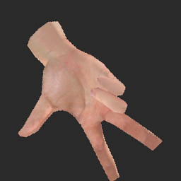
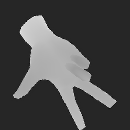
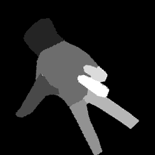
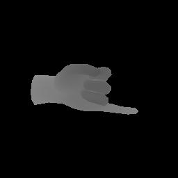
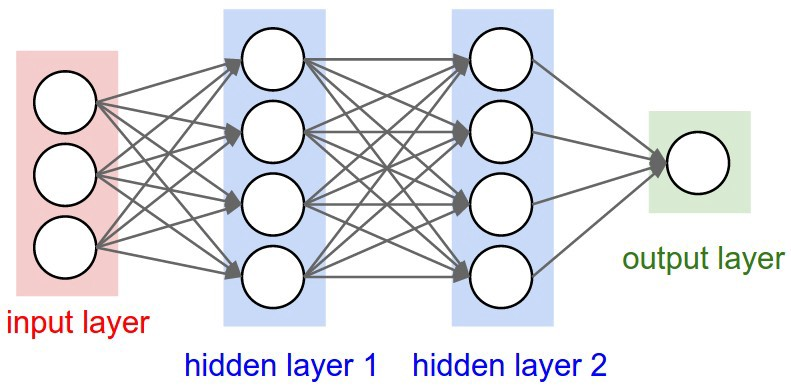

# Riconoscimento delle parti della mano mediante deep learning

<!-- vscode-markdown-toc -->
* 1. [Introduzione](#Introduzione)
* 2. [La rete neurale](#Lareteneurale)
	* 2.1. [Il problema della segmentazione semantica](#Ilproblemadellasegmentazionesemantica)
		* 2.1.1. [Convoluzione](#Convoluzione)
		* 2.1.2. [Max pooling](#Maxpooling)
* 3. [ U-Net](#U-Net)
	* 3.1. [ Contrazione](#Contrazione)
		* 3.1.1. [ReLU //TODO sostituire con attivazione generica](#ReLUTODOsostituireconattivazionegenerica)
	* 3.2. [Espansione](#Espansione)
* 4. [ I dati](#Idati)
	* 4.1. [Generazione dei dati sintetici](#Generazionedeidatisintetici)
	* 4.2. [Adattare i dati sintetici al modello reale](#Adattareidatisinteticialmodelloreale)
	* 4.3. [La depth map](#Ladepthmap)
* 5. [Allenamento della rete](#Allenamentodellarete)
	* 5.1. [Divisione dei dati](#Divisionedeidati)
	* 5.2. [Inizializzazione dei parametri e funzioni di attivazione](#Inizializzazionedeiparametriefunzionidiattivazione)
	* 5.3. [Feed forward](#Feedforward)
	* 5.4. [Back-propagation](#Back-propagation)
* 6. [Fonti](#Fonti)

<!-- vscode-markdown-toc-config
	numbering=true
	autoSave=true
	/vscode-markdown-toc-config -->
<!-- /vscode-markdown-toc -->

##  1. Introduzione

Il progetto di segmentazione di una mano vede il suo fine in un più ampio contesto di riconoscimento gestuale, mirato al miglioramento dell'interazione uomo-macchina. Questo obiettivo richiede di passare attraverso l'identificazione delle diverse componenti della mano, per generare un input più stabile da fornire alla rete neurale per l'identificazione del gesto. In seguito, quindi, si tratterà della prima fase di questo più ampio progetto.

La trattazione sarà in primo luogo generale, mirata a descrivere il generico approccio ad un problema di segmentazione tramite reti neurali convoluzionali, e nella seconda parte andranno a descrivere più nel dettaglio le scelte implementative specifiche del caso.

Si partirà con la discussione del problema della segmentazione semantica in generale, accennando agli specifici elementi che compongono le reti per poter discutere la scelta della tipologia della rete. Si dedicherà poi spazio alla discussione dei dati: le problematiche legate alla loro realizzazione e soluzioni alternative per una generazione numerosa. Infine verrà la trattazione più specifica delle scelte effettuate per risolvere il problema specifico.

##  2. La rete neurale

Il problema in questione rientra in ciò che in machine learning è definito *supervised learning*. Questo consiste nell'allenare una rete neurale fornendole campioni di input e corrispondenti output attesi fino a renderla in grado di risolvere problemi analoghi ma nuovi. La procedura viene effettuata in due fasi temporalmente distinte: la prima di allenamento, computazionalmente onerosa e in cui la rete viene regolata per essere in grado di risolvere il problema, e la seconda di applicazione, in cui data la rete allenata è possibile ottenere l'output desiderato.

###  2.1. Il problema della segmentazione semantica

L'input della rete è stabilito: si tratta di un'immagine di una mano fornita mediante le componenti RGB e una depth map, di cui si discuterà più nel dettaglio nel seguito.
L'output della rete è da stabilire, ma la scelta più naturale consiste nell'etichettare ogni singolo pixel e *classificarlo* assegnandogli un valore che porti con sè le informazioni desiderate.
Si rientra quindi in un problema di classificazione, o più nello specifico, segmentazione semantica.

In generale il problema di classificazione consiste nel ridurre un vettore di ingresso ad una informazione di dimensione minore (come uno scalare). Un esempio è il problema di classificazione di cifre scritte a mano: data un'immagine la rete deve essere in grado di riconoscere quale cifra rappresenta, fornendo un valore in uscita secondo una convenzione da stabilire (un intero, un vettore booleano...).
Il ridimensionamento, e con esso il concentramento dell'informazione, avviene in diversi livelli consecutivi.

Questa procedura, tuttavia, non è adatta allo scopo qui trattato così come è stata presentata: infatti l'informazione a cui si vuol giungere non è di dimensione inferiore all'input e tantomeno scalare. Si ricorre quindi all'*upsampling*, che permette di ridistribuire l'informazione dopo averla concentrata.

Prima di trattare nello specifico la rete adottata, è necessario conoscere i blocchi e le operazioni di cui si compone, che verranno quindi brevemente esposti.

####  2.1.1. Convoluzione

L'input dell'operazione di convoluzione consiste in una matrice tridimensionale (un volume) di taglia *n\*in\*nin\*channels*. A compiere la manipolazione dell'input sono *k* filtri *f\*f\*channels*.

La funzione dei filtri, collezioni *kernel*, è quella di scorrere lungo la matrice in input, compiendo l'operazione di convoluzione e generando in output una matrice riportante una forma di compressione locale delle informazioni originali. Ogni kernel agisce in modo indipendente sul relativo canale dell'immagine e l'output del filtro è la combinazione di questi.

L'output che viene generato ha dimensione *nout\*nout\*k*, in cui nout risuta , dove *p* rappresenta la dimensione di *padding* della convoluzione e *s* lo *stride*.
//TODO sostituire in latex

####  2.1.2. Max pooling

L'informazione, così come fornita in input, non è esaminabile immediatamente, in quanto non è possibile avere una visione d'insieme di uno volume così ampio. L'idea di fondo è quella di ridurre le informazioni da analizzare, mantenendo solo le più importanti (nel caso del max pooling, i pixel con i valori massimi) per ogni regione.

Mediante il *pooling*, ad ogni livello i filtri diventano sempre più consci del contesto complessivo dell'immagine, in quanto questa è sempre più concentrata in poco spazio e diventa analizzabile da un singolo filtro. Grazie a questa procedura, quindi, è possibile analizzare l'immagine nella sua interezza, rendendo più chiaro *cosa* rappresenta, ma perdendo l'informazione sul *dove* i pixel si trovassero nell'input. Le procedure che vengono eseguite sono lecite nelle reti convoluzionali in virtù dell'invarianza alla traslazione delle componenti elementari di cui si compongono: non è la posizione assoluta a contare, ma quella relativa.

Si deve osservare come però, per il problema di segmentazione, questo possa sembrare controproducente: è infatti fondamentale ripristinare l'informazione spaziale.

A questo scopo interviene l'*upsampling*, per invertire la procedura di condensamento e riportare i risultati alle coordinate originali. Una tecnica che discende naturalmente dalla convoluzione è la *deconvoluzione*, o *backwards convolution*, che semplicemente è la sua inversione.

##  3.  U-Net

La struttura che è stata scelta per la rete è una U-Net, sviluppata da Olaf Ronneberger per l'analisi di immagini biomediche. La rete si presta bene al problema per via della sua struttura a encoder-decoder che permette prima di comprimere e successivamente espandere il tensore in ingresso per le finalità sopra citate.

###  3.1.  Contrazione

La prima parte della rete ad essere attraversata è quella di contrazione. Qui 4 blocchi codificatori (*encoder*) si susseguono concatentati uno all'altro.

Un encoder è costituito da diversi livelli, tra cui di convoluzione, attivazione e pooling.

####  3.1.1. ReLU //TODO sostituire con attivazione generica

Per spiegare in cosa consistono i livelli di attivazione è necessario comprendere le componenti "atomiche" di ogni rete neurale: i *neuroni*.

Un neurone è l'elemento elementare della rete, di cui i livelli sono composti. Ha lo scopo di valutare l'input pesato e a cui viene applicato un bias e a seconda del valore ottenuto decidere se attivarsi. //TODO

Una funzione di attivazione molto comune nei modelli di deep learning è la *Rectified Linear Unit*, o *ReLU*, ed è stata impiegata anche in questo contesto. Viene descritta da `f(x) = max(0,x)` e nonostante la sua semplicità è molto efficace: a differenza della altrettanto nota tangente iperbolica, l'allenamento è più efficiente e rapido, adatto a computazioni complesse.

###  3.2. Espansione

Successivamente alla contrazione, dopo aver attraversato un nodo centrale, il tensore attraversa l'ultimo ramo della rete, in cui la sua dimensione viene ripristinata a quella iniziale passando attraverso i *decoder*.

La simmetria della rete rende superflua una discussione approfondita dei decoder. Tuttavia questi ricevono in input non solo il tensore rappresentativo dell'immagine: infatti avviene anche una concatenazione tra encoder e decoder corrispondente (operanti allo stesso "livello") per inglobare anche l'informazione riguardante il contesto.

##  4.  I dati

L'allenamento della rete richiede una grande mole di dati in input. Questo è un ostacolo, in quanto ad ogni immagine deve essere associata una maschera rappresentante le etichette non generabile in automatico (altrimenti avremmo già la soluzione della segmentazione e la costruzione della rete sarebbe inutile).

Il numero di dati necessari per il corretto allenamento è nell'ordine delle migliaia, questo per evitare che la rete finisca in *overfitting* e per renderla flessibile ai diversi input. L'*overfitting* avviene quando i dati di allenamento della rete sono troppo pochi o troppo simili e quindi la rete impara a rispondere in modo pressochè perfetto a casi già visti, ma non è in grado di gestirne di nuovi.

Poichè non è possibile generare manualmente le maschere con le categorie per le migliaia di immagini necessarie, viene utilizzato un [generatore sintetico](http://lttm.dei.unipd.it/downloads/handposegenerator/). Questo è in grado di applicare una texture ad una mano della quale si possono controllare i movimenti.

In questo modo si riescono a generare dati illimitati con uno sforzo umano indipendente dalla dimensione del set desiderata. Tuttavia questo metodo porta degli svantaggi: i dati sintetici sono privi di rumore, variabilità e altri disturbi che invece sono presenti nelle immagini reali. 

Altro aspetto piuttosto limitante, da non sottovalutare, è la dimensione dei dati generati. Qui si è utilizzato un set di 11 gesti,per ciascuno ci sono 200 immagini 256x256 sia rgb+depth (4 canali), sia di classificazione (ad un canale), per un totale di circa 6 GB. Seppur possa sembrare una quantità non troppo eccessiva, va tenuto conto che questa si deve sommare alla dimensione della rete e che queste dimensioni eccedono le normali capacità dei computer domestici. Questi problemi hanno contribuito in modo non indifferente a rallentare il progetto ed evidenziano i punti di debolezza delle reti neurali.

###  4.1. Generazione dei dati sintetici

La generazione dei dati avviene a partire da gesti predefiniti, quelli di interesse per il problema finale di riconoscimento gestuale. Questi vengono perturbati casualmente per creare più varietà possibile di immagini. 
Ad ogni posizione della mano corrispondono tre immagini generate:
- Due immagini rgb (in realtà a 4 canali, ma uno di nessun interesse): una a cui viene applicata la skin della pelle umana e una a cui corrispondono i colori rappresentanti le classi
- Un'immagine a un canale con l'informazione sulla distanza (la profondità)

Le immagini così generate, però, non sono ancora pronte per essere fornite alla rete: avviene ora la fase di assemblamento di rgb e depth in un'unico tensore e di remapping del tensore delle classi in una matrice a valori interi.

###  4.2. Adattare i dati sintetici al modello reale

Ora i dati contengono le informazioni essenziali per il riconoscimento di gesti, ma presentano tutti delle caratteristiche comuni molto forti e innaturali.

Un problema subito evidente è l'orientamento: tutte le mani hanno il polso rivolto a sinistra. Per risolvere il problema è sufficiente applicare una rotazione casuale alle immagini, di un numero di gradi nel range 0-360 poichè sono tutte rotazioni plausbili.

Anche la centralità dell'immagine è poco naturale, ma basta applicare piccole traslazioni per ovviare al problema.

Ci sono molte altre modifiche possibili per migliorare le immagini, come riscalarle casualmente, applicare filtri per modificare la luminosità, aggiungere rumore e disturbi, cambiare colori, applicare piccole distorsioni.

###  4.3. La depth map

Ulteriore vantaggio dell'uso del generatore è la generazione contestuale delle *depth map* delle immagini, ossia la rappresentazione delle informazioni sulla tridimensionalità della mano mediante un'immagine ad un canale. Questa è un'informazione ulteriore che non viene fornita dalle normali fotocamere, ma che può essere generata comunque anche nella realtà mediante sensori appositi.

##  5. Allenamento della rete

È adesso possibile iniziare l'allenamento della rete e quindi ottenere i primi risultati.

###  5.1. Divisione dei dati

La rete necessita di tre diversi set di dati, che sono estratti casualmente tra quelli generati precedentemente, secondo proporzioni prestabilite.

Lo scopo dell'allenamento è impostare i parametri della rete affinchè performi al meglio. Questi vengono impostati facendo attraversare l'input nella rete, che in output fornirà un tensore dipendente dagli stessi parametri. Inizialmente questi assumono valori pseudo-casuali, che vengono aggiustati nella fase di *backpropagation* grazie alle *labels* (il tensore delle classi) fornite insieme alle immagini di input. Il primo set, di *training*, (il più ampio, che rappresenta il 70% dei dati), viene impegato a questo proposito.

Nella fase successiva vengono valutate le performance della rete con i nuovi parametri e per questo scopo si impiega il set di *validation*, (20% del set originario) sul quale si calcolano i parametri di misura dell'efficienza per monitorare dati oggettivi sulla qualità di apprendimento ed eventualmente fermarlo in caso di mancato miglioramento.

L'ultimo set, di *test* (il restante 10%), viene utilizzato per la verifica finale dei risultati dell'allenamento.

###  5.2. Inizializzazione dei parametri e funzioni di attivazione

Gli *iperparametri* della rete sono valori associati ad ogni neurone di ogni livello. I neuroni sono le entità atomiche della rete e ne determinano il funzionamento. Ogni neurone ha il compito di restituire un output fornito da una funzione che viene scelta in base alle esigenze.

Con livello si intende un insieme di neuroni che operano in parallelo. Ognuno di essi riceve gli stessi input (nel caso di una rete completamente connessa) e determina un output definito da una stessa *funzione di attivazione* i cui parametri, però, sono dipendenti dal singolo neurone. Più nello specifico si tratta di un peso, per cui viene moltiplicato l'input, e di un bias. L'insieme dei parametri di tutta la rete costituisce gli *iperparametri*.

La rete è composta di diversi livelli, collegati tra loro in quanto l'output del livello precedente è l'input del successivo, e che si dividono in tre categorie: *input*, *output* e *hidden*. Su questi ultimi c'è un maggior margine di libertà per quanto riguarda la scelta della dimensione (numero di neuroni) e della funzione di attivazione, mentre l'input e l'output sono vincolati dalle dimensioni dei tensori di ingresso e uscita e dalla loro tipologia; inoltre si trovano agli estremi della rete.

La scelta della funzione di attivazione non è solo vincolata alle sue caratteristiche matematiche, ma anche all'efficienza della sua computazione: si deve ricordare infatti che il numero di neuroni è estremamente elevato, e di conseguenza anche i calcoli sono temporalmente dispendiosi.

La facilità di calcolo e la rapidità nella convergenza sono la ragione per cui per negli hidden layers (che nella rete utilizzata in questo caso sono incapsulati in encoder e decoder) viene utilizzata la *ReLU*, *rectified linear unit*, con il comportamento da funzione identità per valori in ingresso positivi e che invece appiattisce a 0 i valori negativi. Nella sua semplicità, non si potrebbe ricondurre a una funzione completamente lineare, che avrebbe derivata costante e impedirebbe la backpropagation. Tuttavia questa scelta può condurre ad un problema: quando l'input approccia lo zero o un valore negativo si ferma l'apprendimento come conseguenza dell'impossibilità di svolgere la backpropagation. Nel livello di output invece viene impiegata la *softmax*, o esponenziale normalizzata. Questa viene impiegata nei problemi di classificazione non binari e il suo output rappresenta la probabilità di appartenenza alla classe. Grazie alla sua caratteristica esponenziale le differenze tra i valori di input vengono amplificate in uscita.
// TODO un grafico o una formula

I neuroni sono quindi funzioni i cui parametri devono essere ottimizzati per riuscire ad ottenere l'output desiderato e che inizialmente vengono impostati a valori casuali tra 0 e 1.

###  5.3. Feed forward

La *forward propagation* è così detta in quanto è la fase in cui i dati attraversano la rete nella sua direzione "naturale", ossia input-output.

Durante la forward propagation ogni unità (neurone) pesa l'input e vi aggiunge la componente di bias, per poi applicare al valore ottenuto la funzione di attivazione.

###  5.4. Back-propagation

Avviene ora la fase di correzione degli errori per approssimazioni successive. Interviene a questo proposito la *loss function*.

La loss function che è stata scelta in questo caso è la *Cross-Entropy dice loss*. Questa deriva dalla *Cross Entropy* (CE) loss, funzione che misura le performance di una rete il cui output è una probabilità ed è quindi adatta alla rete qui utilizzata, in quanto l'output layer utilizza la softmax activation function. Questa loss misura l'entropia mutua tra il risultato ottenuto e quello atteso. Quello che ci si aspetta è che il valore dell'entropia mutua decresca ad ogni epoca (ciclo di allenamento della rete) e che quindi i risultati ottenuti siano sempre più fedeli a quelli attesi. Tuttavia questa metrica potrebbe portare a risultati falsati in questo caso, essendo le classi sbilanciate: tutte le immagini presentano la classe "sfondo" dominante su altre classi come "mignolo", in quanto lo sfondo occuperà molti più pixel nell'immagine rispetto ad altre classi. Utilizzare la CE loss potrebbe portare quindi a risultati sbilanciati, perciò occorre un fattore di correzione. Questo è costituito dalla dice loss // Formula dice loss, commento dice loss
//TODO formule grafici CE

A prescindere dalla scelta della funzione di loss, l'obiettivo sarà quello di minimizzarla per ridurre la discrepanza tra valore ottenuto e desiderato. Per far questo viene calcolato il gradiente della loss (calcolato rispetto ai suoi parametri) al fine di avvicinarsi al minimo della funzione. Il metodo della discesa del gradiente consiste nello spostarsi nella curva (della funzione) lungo la direzione di decrescita e permette di evitare il calcolo della derivata globale della funzione per l'individuazione dei punti di minimo. Lo spostamento lungo la curva rappresenta la modifica dei parametri, che avviene in modo proporzionale alla derivata parziale della loss.
Questo sistema presenta però degli svantaggi: non c'è garanzia di trovare il minimo globale, infatti con questo sistema una volta situati in un punto di minimo locale non è possibile uscirne e vi sono difficoltà anche nell'attraversamento di plateau.
//TODO immagine gradient descent

##  6. Fonti

- Natural Networks and Deep Learning - Michael Nielsen

- Encoder-Decoder with Atrous Separable Convolution for Semantic Image Segmentation - Liang-Chieh Chen, Yukun Zhu,George Papandreou, Florian Schroff, and Hartwig Adam

- Fully Convolutional Networks for Semantic Segmentation - Jonathan Long, Evan Shelhamer, Trevor Darrell, UC Berkeley

- U-Net: Convolutional Networks for Biomedial Image Segmentation - Olaf Ronneberger, Philipp Fischer, and Thomas Brox

- Generalised Wasserstein Dice Score for Imbalanced Multi-class Segmentation using Holistic Convolutional Networks - Lucas Fidon,Wenqi Li, Luis C. Garcia-Peraza-Herrera, Jinendra Ekanayake, Neil Kitchen,Sébastien Ourselin, and Tom Vercauteren

- EddyNet: A Deep Neural Network For Pixel-Wise Classification of Oceanic Eddies - Redouane Lguensat, Member, IEEE, Miao Sun, Ronan Fablet, Senior Member, IEEE, Evan Mason, Pierre Tandeo, and Ge Chen

- AnatomyNet: Deep Learning for Fast and Fully Automated Whole-volume Segmentation of Head and Neck Anatomy - Wentao Zhu, Yufang Huang, Liang Zeng, Xuming Chen and Yong Liu, Zhen Qian, Nan Du and Wei Fan, Xiaohui Xie

- Dice Loss Function for image Segmentation Using Dense Dilation Spatial Pooling Network, Qiuhua Liu, Min Fu
