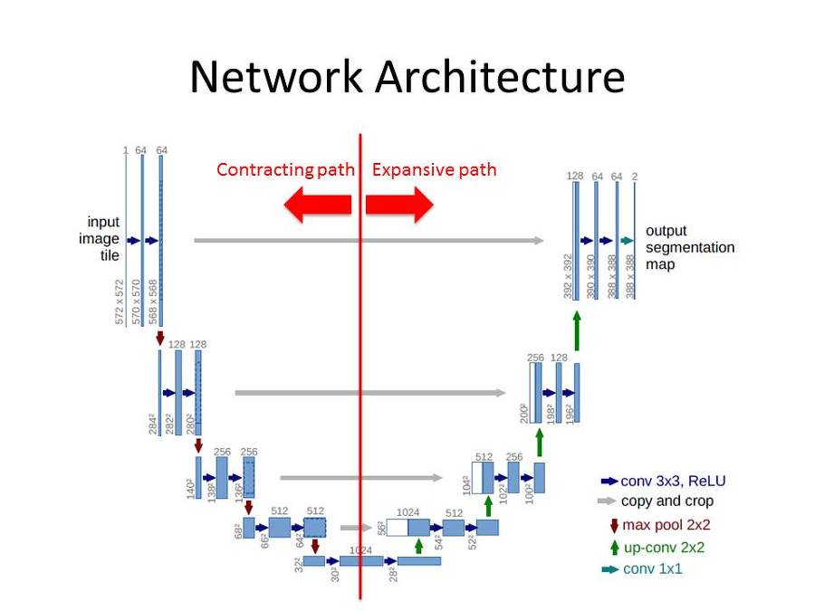
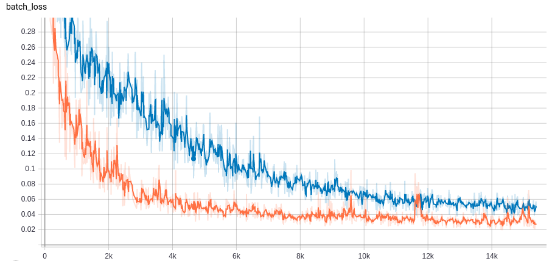

# Riconoscimento delle parti della mano mediante deep learning

Favaro Marzia

Relatore: Pietro Zanuttigh

Corso di laurea in Ingegneria dell'Informazione

15 Luglio 2019
Anno Accademico 2018-2019

Firma studente Firma relatore

\pagebreak

<!-- vscode-markdown-toc -->
* 1. [Introduzione](#Introduzione)
* 2. [La rete neurale](#Lareteneurale)
	* 2.1. [Il problema della segmentazione semantica](#Ilproblemadellasegmentazionesemantica)
	* 2.2. [Le sottostrutture della rete](#Lesottostrutturedellarete)
		* 2.2.1. [Convoluzione](#Convoluzione)
		* 2.2.2. [Max pooling](#Maxpooling)
		* 2.2.3. [Funzioni di attivazione](#Funzionidiattivazione)
	* 2.3. [U-Net](#U-Net)
		* 2.3.1. [Contrazione](#Contrazione)
		* 2.3.2. [Espansione](#Espansione)
* 3. [ I dati](#Idati)
	* 3.1. [Generazione dei dati sintetici](#Generazionedeidatisintetici)
	* 3.2. [Adattare i dati sintetici al modello reale](#Adattareidatisinteticialmodelloreale)
	* 3.3. [La depth map](#Ladepthmap)
* 4. [Allenamento della rete](#Allenamentodellarete)
	* 4.1. [Divisione dei dati](#Divisionedeidati)
	* 4.2. [Inizializzazione dei parametri e funzioni di attivazione](#Inizializzazionedeiparametriefunzionidiattivazione)
	* 4.3. [Feed forward](#Feedforward)
	* 4.4. [Back-propagation](#Back-propagation)
		* 4.4.1. [Gradient descent](#Gradientdescent)
		* 4.4.2. [Varianti](#Varianti)
* 5. [Risultati](#Risultati)
	* 5.1. [La struttura della rete](#Lastrutturadellarete)
	* 5.2. [SGD vs Adam](#SGDvsAdam)
	* 5.3. [Scelta del batch size](#Sceltadelbatchsize)
* 6. [Fonti](#Fonti)

<!-- vscode-markdown-toc-config
	numbering=true
	autoSave=true
	/vscode-markdown-toc-config -->
<!-- /vscode-markdown-toc -->

\pagebreak

##  1. Introduzione

Il progetto di segmentazione di una mano vede il suo fine in un più ampio contesto di riconoscimento gestuale, mirato al miglioramento dell'interazione uomo-macchina. Questo obiettivo richiede di passare attraverso l'identificazione delle diverse componenti della mano, per generare un input più stabile da fornire alla rete neurale per l'identificazione del gesto. In seguito, quindi, si tratterà della prima fase di questo più ampio progetto.

La trattazione sarà in primo luogo generale, mirata a descrivere il generico approccio ad un problema di segmentazione tramite reti neurali convoluzionali, e nella seconda parte andranno a descrivere più nel dettaglio le scelte implementative specifiche del caso.

Si partirà con la discussione del problema della segmentazione semantica in generale, accennando agli specifici elementi che compongono le reti per poter discutere la scelta della tipologia della rete. Si dedicherà poi spazio alla discussione dei dati: le problematiche legate alla loro realizzazione e soluzioni alternative per una generazione numerosa. Infine verrà la trattazione più specifica delle scelte effettuate per risolvere il problema specifico e un commento sui risultati ottenuti.

Il codice sorgente è disponibile su github:

https://github.com/marziaf/hand-segmentation

\pagebreak

##  2. La rete neurale

Il problema in questione rientra in ciò che in machine learning è definito *supervised learning*. Questo consiste nell'allenare una rete neurale fornendole campioni di input e corrispondenti output attesi fino a renderla in grado di risolvere problemi analoghi ma nuovi. La procedura viene effettuata in due fasi temporalmente distinte: la prima di allenamento, computazionalmente onerosa e in cui la rete viene regolata per essere in grado di risolvere il problema, e la seconda di applicazione, in cui data la rete allenata è possibile ottenere l'output desiderato.

###  2.1. Il problema della segmentazione semantica

L'input della rete è stabilito: si tratta di un'immagine di una mano fornita mediante le componenti RGB e una depth map, di cui si discuterà più nel dettaglio nel seguito.
L'output della rete è da stabilire, ma la scelta più naturale consiste nell'etichettare ogni singolo pixel e *classificarlo* assegnandogli un valore che porti con sè le informazioni desiderate.
Si rientra quindi in un problema di classificazione, o più nello specifico, segmentazione semantica.

In generale il problema di classificazione consiste nel ridurre un vettore di ingresso ad una informazione di dimensione minore (come uno scalare). Un esempio è il problema di classificazione di cifre scritte a mano: data un'immagine la rete deve essere in grado di riconoscere quale cifra rappresenta, fornendo un valore in uscita secondo una convenzione da stabilire (un intero, un vettore booleano...).
Il ridimensionamento, e con esso il concentramento dell'informazione, avviene in diversi livelli consecutivi.

Questa procedura, tuttavia, non è adatta allo scopo qui trattato così come è stata presentata: infatti l'informazione a cui si vuol giungere non è di dimensione inferiore all'input e tantomeno scalare. Si ricorre quindi all'*upsampling*, che permette di ridistribuire l'informazione dopo averla concentrata.

Prima di trattare nello specifico la rete adottata, è necessario conoscere i blocchi e le operazioni di cui si compone, che verranno quindi brevemente esposti.

###  2.2. Le sottostrutture della rete

####  2.2.1. Convoluzione

L'input dell'operazione di convoluzione consiste in un tensore (un volume) di taglia *n\*in\*nin\*channels*. A compiere la manipolazione dell'input sono *k* filtri *f\*f\*channels*: la convoluzione non avviene infatti su tutta la matrice nella sua interezza, ma avviene localmente in k regioni.

La funzione dei filtri, collezioni *kernel*, è quella di scorrere lungo la matrice in input, compiendo l'operazione di convoluzione e generando in output una matrice riportante una forma di compressione locale delle informazioni originali. Ogni kernel agisce in modo indipendente sul relativo canale dell'immagine e l'output del filtro è la combinazione di questi.

L'output che viene generato ha dimensione *nout\*nout\*k*, in cui nout risuta , dove *p* rappresenta la dimensione di *padding* della convoluzione e *s* lo *stride*. Il padding consiste nell'aggiungere un margine attorno all'immagine per non perdere l'informazione di bordo. Lo stride invece è l'indicatore di "velocità" di spostamento dei filtri, ossia di quanto si spostano ad ogni passaggio. Minore è lo stride, maggiore è la sovrapposizione dei filtri.
//TODO sostituire in latex

####  2.2.2. Max pooling

L'informazione, così come fornita in input, non è esaminabile direttamente, in quanto non è possibile avere una visione d'insieme di uno volume così ampio. L'idea di fondo è quella di ridurre le informazioni da analizzare, mantenendo solo le più importanti (nel caso del max pooling, i pixel con i valori massimi) per ogni regione.

Mediante il *pooling*, ad ogni livello i filtri diventano sempre più consci del contesto complessivo dell'immagine, in quanto questa è sempre più concentrata in poco spazio e diventa analizzabile da filtri sempre più piccoli. Grazie a questa procedura, quindi, è possibile analizzare l'immagine nella sua interezza, rendendo più chiaro *cosa* rappresenta, ma perdendo l'informazione sul *dove* l'informazione si trovasse rispetto all'input. Le procedure che vengono eseguite sono lecite nelle reti convoluzionali in virtù dell'invarianza alla traslazione delle componenti elementari di cui si compongono: non è la posizione assoluta a contare, ma quella relativa.

Si deve osservare come però, per il problema di segmentazione, questo possa sembrare controproducente: è infatti fondamentale ripristinare l'informazione spaziale.

A questo scopo interviene l'*upsampling*, per invertire la procedura di condensamento e riportare i risultati alle coordinate originali. Una tecnica che discende naturalmente dalla convoluzione è la *deconvoluzione*, o *backwards convolution*, che semplicemente è la sua inversione.

####  2.2.3. Funzioni di attivazione

Per spiegare in cosa consistono i livelli di attivazione è necessario comprendere le componenti "atomiche" di ogni rete neurale: i *neuroni*, che saranno però discussi più nel dettaglio in seguito. Ogni neurone possiede un insieme di ingressi provenienti da altri neuroni, e un'uscita che a sua volta è passata in input ad altri neuroni. Questi hanno un livello di attivazione che definisce lo stato del neurone come acceso o spento dipendentemente dal tipo di funzione di attivazione che li caratterizza e dai suoi parametri. Mediante la regolazione di questi ultimi, infatti, si determina il comportamento dei neuroni e quindi la risposta della rete agli input.

\pagebreak

###  2.3. U-Net

La struttura che è stata scelta per la rete è una U-Net, sviluppata da Olaf Ronneberger per l'analisi di immagini biomediche. La rete si presta bene al problema per via della sua struttura a encoder-decoder che permette prima di comprimere e successivamente espandere il tensore in ingresso per le finalità sopra citate.

####  2.3.1. Contrazione

La prima parte della rete ad essere attraversata è quella di contrazione. Qui 4 blocchi codificatori (*encoder*) si susseguono concatentati uno all'altro e trasformano i tensori diminuendone lunghezza e larghezza e aumentandone la profondità. Un encoder è costituito da diversi livelli, tra cui di convoluzione, attivazione e pooling.

####  2.3.2. Espansione

Successivamente alla contrazione, dopo aver attraversato un nodo centrale, il tensore attraversa l'ultimo ramo della rete, in cui la sua dimensione viene ripristinata a quella iniziale passando attraverso i *decoder*.

La simmetria della rete rende superflua una discussione approfondita dei decoder. Tuttavia va osservato come questi ricevono in input non solo il tensore rappresentativo dell'immagine: infatti avviene anche una concatenazione tra encoder e decoder corrispondente (operanti allo stesso "livello") per inglobare anche l'informazione riguardante il contesto.

\pagebreak

##  3.  I dati

L'allenamento della rete richiede una grande mole di dati in input. Questo è un ostacolo, in quanto ad ogni immagine deve essere associata una maschera rappresentante le etichette non generabile in automatico (altrimenti si avrebbe già la soluzione della segmentazione e la costruzione della rete sarebbe inutile).

Il numero di dati necessari per il corretto allenamento è dell'ordine delle migliaia, questo per evitare che la rete finisca in *overfitting* e per renderla flessibile ai diversi input. L'*overfitting* avviene quando i dati di allenamento della rete sono troppo pochi o troppo simili e quindi la rete impara a rispondere in modo pressochè perfetto a casi già visti, ma non è in grado di gestirne di nuovi.

Poichè non è possibile generare manualmente le maschere con le categorie per le migliaia di immagini necessarie, viene utilizzato un [generatore sintetico](http://lttm.dei.unipd.it/downloads/handposegenerator/)//{TODO in latex mettere nota a piè di pagina}. Questo è in grado di applicare una texture ad una mano della quale si possono controllare i movimenti.

In questo modo si riescono a generare dati illimitati con uno sforzo umano indipendente dalla dimensione del set desiderato. Tuttavia questo metodo porta degli svantaggi: i dati sintetici sono privi di rumore, variazioni di luminosità, ombre e altri disturbi che invece sono presenti nelle immagini reali. 

Altro aspetto piuttosto limitante, da non sottovalutare, è la dimensione dei dati generati. Qui si è utilizzato un set di 11 gesti, per ciascuno ci sono 200 immagini 256x256 sia rgb+depth (4 canali), sia di classificazione (ad un canale), per un totale di circa 5 GB. Seppur possa sembrare una quantità non troppo eccessiva, va tenuto conto che questa si deve sommare alla dimensione della rete e allo spazio utilizzato nei calcoli, e che queste dimensioni eccedono la normale capacità delle ram dei computer domestici. Questi problemi hanno contribuito in modo non indifferente a rallentare il progetto ed evidenziano i punti di debolezza delle reti neurali.

###  3.1. Generazione dei dati sintetici

La generazione dei dati avviene a partire da gesti predefiniti, quelli di interesse per il problema finale di riconoscimento gestuale. Questi vengono perturbati casualmente per creare più varietà possibile di immagini. 
Ad ogni posizione della mano corrispondono tre immagini generate:
- Due immagini rgb (in realtà a 4 canali, ma uno di nessun interesse): una a cui viene applicata la texture della pelle umana e una a cui corrispondono i colori rappresentanti le classi
- Un'immagine a un canale con l'informazione sulla distanza (la profondità)

Le immagini così generate, però, non sono ancora pronte per essere fornite alla rete: avviene ora la fase di assemblamento di rgb e depth in un'unico tensore e di remapping del tensore delle classi in una matrice a valori interi.

###  3.2. Adattare i dati sintetici al modello reale

Ora i dati contengono le informazioni essenziali per il riconoscimento di gesti, ma presentano tutti delle caratteristiche comuni molto forti e innaturali.

Un problema subito evidente è l'orientamento: tutte le mani hanno il polso rivolto a sinistra. Per risolvere il problema è sufficiente applicare una rotazione casuale alle immagini, di un numero di gradi nel range 0-360 poichè sono tutte rotazioni plausbili. Oltretutto tutte le mani generate sono sinistre, quindi alcune saranno specchiate per diventare destre.

Anche la centralità dell'immagine è poco naturale, ma basta applicare piccole traslazioni per ovviare al problema.

Ci sono molte altre modifiche possibili per migliorare le immagini, come riscalarle casualmente, applicare filtri per modificare la luminosità, aggiungere rumore e disturbi, cambiare colori, applicare piccole distorsioni.

Alcune di queste modifiche sono state quindi apportate in una fase di pre-processing.

###  3.3. La depth map

Ulteriore vantaggio dell'uso del generatore è la generazione contestuale delle *depth map* delle immagini, ossia la rappresentazione delle informazioni sulla tridimensionalità della mano mediante un'immagine ad un canale. Questa è un'informazione ulteriore che non viene fornita dalle normali fotocamere, ma che può essere generata comunque anche nella realtà mediante sensori appositi.

\pagebreak

##  4. Allenamento della rete

È adesso possibile iniziare l'allenamento della rete e quindi ottenere i primi risultati.

###  4.1. Divisione dei dati

La rete necessita di tre diversi set di dati, che sono estratti casualmente tra quelli generati precedentemente, secondo proporzioni prestabilite.

Lo scopo dell'allenamento è impostare i parametri della rete affinchè performi al meglio. Questi vengono impostati facendo attraversare l'input nella rete, che in output fornirà un tensore dipendente dagli stessi parametri. Inizialmente questi assumono valori pseudo-casuali, che vengono aggiustati nella fase di *backpropagation* grazie alle *labels* (il tensore delle classi) fornite insieme alle immagini di input. Il primo set, di *training*, (il più ampio, che rappresenta il 70% dei dati), viene impiegato a questo proposito.

Nella fase successiva vengono valutate le performance della rete con i nuovi parametri e a questo scopo si impiega il set di *validation*, (20% del set originario) sul quale si calcolano i parametri di misura dell'efficienza per monitorare dati oggettivi sulla qualità di apprendimento ed eventualmente fermarlo in caso di mancato miglioramento.

L'ultimo set, di *test* (il restante 10%), viene utilizzato per la verifica finale dei risultati dell'allenamento. È distinto dai precedenti per evitare che le stesse immagini su cui la rete è stata allenata vengano utilizzate per verificarne le prestazioni: sarà infatti normale che l'output corrispondente ad un'immagine di allenamento sia migliore di uno esterno.

###  4.2. Inizializzazione dei parametri e funzioni di attivazione

I *parametri* della rete sono valori associati ad ogni neurone di ogni livello. I neuroni sono le entità atomiche della rete e ne determinano il funzionamento. Ogni neurone ha il compito di restituire un output fornito da una funzione che viene scelta in base alle esigenze.

Con *livello* si intende un insieme di neuroni che operano in parallelo. Ognuno di essi riceve gli stessi input (nel caso di una rete completamente connessa) e determina un output definito da una stessa *funzione di attivazione* i cui parametri, però, sono dipendenti dal singolo neurone. Più nello specifico si tratta di un peso, per cui viene moltiplicato l'input, e di un bias.

La rete è composta di diversi livelli, collegati tra loro in quanto l'output del livello precedente è l'input del successivo, e che si dividono in tre categorie: *input*, *output* e *hidden*. Su questi ultimi c'è un maggior margine di libertà per quanto riguarda la scelta della dimensione (numero di neuroni) e della funzione di attivazione, mentre l'input e l'output sono vincolati dalle dimensioni dei tensori di ingresso e uscita e dalla loro tipologia; inoltre si trovano agli estremi della rete.

La scelta della funzione di attivazione non è solo vincolata alle sue caratteristiche matematiche, ma anche all'efficienza della sua computazione: si deve ricordare infatti che il numero di neuroni è estremamente elevato, e di conseguenza anche i calcoli sono temporalmente dispendiosi (nella rete utilizzata per la soluzione di questo problema vengono impiegati 31 milioni di parametri da ottimizzare).

La facilità di calcolo e la rapidità nella convergenza sono la ragione per cui per negli hidden layers (che nella rete utilizzata in questo caso sono incapsulati in encoder e decoder) viene utilizzata la *ReLU*, *rectified linear unit*, con il comportamento da funzione identità per valori in ingresso positivi e che invece appiattisce a 0 i valori negativi. Nella sua semplicità, non si potrebbe ricondurre a una funzione completamente lineare, che avrebbe derivata costante e impedirebbe la backpropagation. Tuttavia questa scelta può condurre ad un problema: quando l'input approccia lo zero o un valore negativo si ferma l'apprendimento come conseguenza dell'impossibilità di svolgere la backpropagation. Nel livello di output invece viene impiegata la *softmax*, o esponenziale normalizzata. Questa viene impiegata nei problemi di classificazione non binari e il suo output rappresenta la probabilità di appartenenza alla classe. Grazie alla sua caratteristica esponenziale le differenze tra i valori di input vengono amplificate in uscita.

I neuroni sono quindi funzioni i cui parametri devono essere ottimizzati per riuscire ad ottenere l'output desiderato e che inizialmente vengono impostati a valori casuali tra 0 e 1.

###  4.3. Feed forward

La *forward propagation* è così detta in quanto è la fase in cui i dati attraversano la rete nella sua direzione "naturale", ossia input-output.

Durante la forward propagation ogni unità (neurone) pesa l'input e vi aggiunge la componente di bias, per poi applicare al valore ottenuto la funzione di attivazione.

###  4.4. Back-propagation

Avviene ora la fase di correzione degli errori per approssimazioni successive. Interviene a questo proposito la *loss function*.

La loss function che è stata scelta in questo caso è la *Cross-Entropy dice loss*. Questa deriva dalla *Cross Entropy* (CE) loss, funzione che misura le performance di una rete il cui output è una probabilità ed è quindi adatta alla rete qui utilizzata, in quanto l'output layer utilizza la softmax activation function. Questa loss misura l'entropia mutua tra il risultato ottenuto e quello atteso. Quello che ci si aspetta è che il valore dell'entropia mutua decresca ad ogni epoca (ciclo di allenamento della rete) e che quindi i risultati ottenuti siano sempre più fedeli a quelli attesi. Tuttavia questa metrica potrebbe portare a risultati falsati in questo caso, essendo le classi sbilanciate: tutte le immagini presentano la classe "sfondo" dominante su altre classi come "mignolo", in quanto lo sfondo occuperà molti più pixel nell'immagine rispetto ad altre classi. Utilizzare la CE loss potrebbe portare quindi a risultati sbilanciati, perciò occorre un fattore di correzione. Questo è costituito dalla dice loss // Formula dice loss, commento dice loss
//TODO formule grafici CE

####  4.4.1. Gradient descent

A prescindere dalla scelta della funzione di loss, l'obiettivo sarà quello di minimizzarla per ridurre la discrepanza tra valore ottenuto e desiderato. Per far questo viene calcolato il gradiente della loss (calcolato rispetto ai suoi parametri) al fine di avvicinarsi al minimo della funzione. Il metodo della discesa del gradiente consiste nello spostarsi nella curva (della funzione) lungo la direzione di decrescita e permette di evitare il calcolo della derivata globale della funzione per l'individuazione dei punti di minimo. Lo spostamento lungo la curva rappresenta la modifica dei parametri, che avviene in modo proporzionale alla derivata parziale della loss.
Questo sistema presenta però degli svantaggi: non c'è garanzia di trovare il minimo globale, infatti con questo sistema una volta situati in un punto di minimo locale non è possibile uscirne e vi sono difficoltà anche nell'attraversamento di punti di sella.

La velocità di discesa può essere regolata mediante il *learning rate*, coefficiente che permette di velocizzare o rallentare l'apprendimento. Questo parametro ha anch'esso un suo peso e influisce sulle prestazioni della rete. Un learning rate alto aumenta la velocità di apprendimento, ma potrebbe mancare il minimo e creare oscillazioni intorno ad esso. Per evitare questo fenomeno si può gradualmente ridurre il learning rate durante l'apprendimento. Se il suo valore è basso invece si ottiene maggior precisione, ma il tempo per raggiungere il minimo è maggiore.

La discesa del gradiente si rappresenta come w → w' = w − η∇L //{TODO riscrivere bene} in cui w rappresenta le coordinate nello spazio dei pesi, w' la nuova posizione, L è la funzione da minimizzare (loss) e η il learning rate. Il segno meno è dovuto al fatto che la direzione di spostamento è quella indicata dall'opposto del gradiente, per opporsi alla direzione di massimo.

Nonostante il metodo della discesa del gradiente sia già una grande semplificazione rispetto al calcolo analitico dei punti di minimo, lo si può ancora ottimizzare con metodi di *stochastic gradient descent* (SGD). Quando la funzione L si può esprimere come L(w) = 1/n sum(L_i) //{TODO scrivere in latex}, allora il gradiente si approssima con il gradiente calcolaro su un singolo addendo.
w → w' = w − η∇L_i //{TODO latex}.

Vi sono alcune estensioni di questo concetto che vengono qui accennate.

####  4.4.2. Varianti

*AdaGrad* (*adaptive gradient*) è un metodo che utilizza un tasso di apprendimento indipendente per ogni parametro. I suoi vantaggi sono la sua convergenza generalmente più rapida rispetto a SGD e la capacità di adattare in automatico il learning rate, tuttavia questo parametro tende a cancellarsi ad ogni iterazione, con conseguente arresto dell'apprendimento.

*RMSProp* (*root mean square propagation*) è anch'esso un metodo a tasso di apprendimento adattivo, che però riesce a superare il problema dell'arresto dell'apprendimento introdotto da AdaGrad: il tasso di apprendimento viene controllato dalla media quadratica del gradiente. *AdaDelta* è invece un metodo simile con lo stesso punto di forza di RMSProp.

*Adam* (*adaptive movement estimation*) è un'estensione di RMSProp, ed è un algoritmo di ottimizzazione del secondo ordine che incorpora anche l'Hessiano.

Le ottimizzazioni che si fermano al primo ordine sono più facili da calcolare e impiegano meno tempo, al contrario gli ottimizzatori del secondo ordine sono più lenti.

\pagebreak

##  5. Risultati

Una premessa ai risultati ottenuti è che le potenzialità della rete non sono state sfruttate al massimo a causa di problemi di memoria. Quindi, nonostante si siano raggiunti livelli di qualità sufficienti, probabilmente un allenamento più intensivo frutterebbe ancor meglio.

###  5.1. La struttura della rete

L'aspetto finale della U-net, ossia il *summary* del modello, poichè troppo lungo per essere inserito qui, si trova su github al link https://bit.ly/2S5chUl.

###  5.2. SGD vs Adam

Un primo confronto è stato effettuato tra due metodi di ottimizzazione del gradiente: stochastic gradient descent e Adam. I risultati ottenuti, con un allenamento sul 50% dei dati (770 immagini di allenamento, 220 per la validazione), batch size di 1, allenando la rete su 20 epoche, confermano la teoria: Adam è un algoritmo più performante di SGD. Questo si vede nei dati di allenamento, di cui sono riportati i grafici dell'accuratezza e della loss in funzione dei batch. Si vede come le curve blu, che rappresentano il training con SGD, rappresentino risultati più deboli rispetto alle arancioni di Adam.

Anche visivamente, utilizzando il set di test per controllare l'output della rete con il solo ingresso dell'immagine rgbd, si nota la differenza.

SGD:

Adam:

###  5.3. Scelta del batch size

La dimensione dei batch è stata condizionata molto dalle risorse a disposizione, in quanto un suo incremento comporta un maggior consumo di memoria. Questa grandezza indica il numero di immagini utilizzate ad ogni iterazione, ossia quanti dati vengono filtrati dalla rete prima di aggiornare i suoi parametri. Un buon punto di partenza sarebbe stato di 32, ma potenzialmente anche maggiore. Purtroppo con il crescere di questo valore aumenta la complessità computazionale e l'occupazione di memoria, risorse di cui non c'è stata disponibilità. Si è fatto però un confronto tra l'allenamento tra batch di dimensione 1 e 2, e i risultati sono stati quelli attesi: la convergenza avviene più velocemente aumentando questo valore.

// TODO optimizers (adam, adadelta...) + learning rate
regularization
early stopping

\pagebreak

##  6. Fonti

- Natural Networks and Deep Learning - Michael Nielsen

- Encoder-Decoder with Atrous Separable Convolution for Semantic Image Segmentation - Liang-Chieh Chen, Yukun Zhu,George Papandreou, Florian Schroff, and Hartwig Adam

- Fully Convolutional Networks for Semantic Segmentation - Jonathan Long, Evan Shelhamer, Trevor Darrell, UC Berkeley

- U-Net: Convolutional Networks for Biomedial Image Segmentation - Olaf Ronneberger, Philipp Fischer, and Thomas Brox

- Generalised Wasserstein Dice Score for Imbalanced Multi-class Segmentation using Holistic Convolutional Networks - Lucas Fidon,Wenqi Li, Luis C. Garcia-Peraza-Herrera, Jinendra Ekanayake, Neil Kitchen,Sébastien Ourselin, and Tom Vercauteren

- EddyNet: A Deep Neural Network For Pixel-Wise Classification of Oceanic Eddies - Redouane Lguensat, Member, IEEE, Miao Sun, Ronan Fablet, Senior Member, IEEE, Evan Mason, Pierre Tandeo, and Ge Chen

- AnatomyNet: Deep Learning for Fast and Fully Automated Whole-volume Segmentation of Head and Neck Anatomy - Wentao Zhu, Yufang Huang, Liang Zeng, Xuming Chen and Yong Liu, Zhen Qian, Nan Du and Wei Fan, Xiaohui Xie

- Dice Loss Function for image Segmentation Using Dense Dilation Spatial Pooling Network - Qiuhua Liu, Min Fu

- Adam: A Method for Stochastic Optimization - Diederik P. Kingma, Jimmy Lei Ba

- Large-Scale Machine Learning with Stochastic Gradient Descent - Léon Bottou

- http://cs231n.github.io/convolutional-networks/